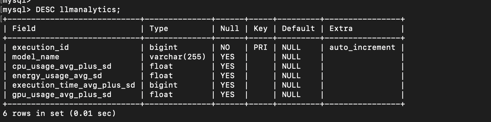
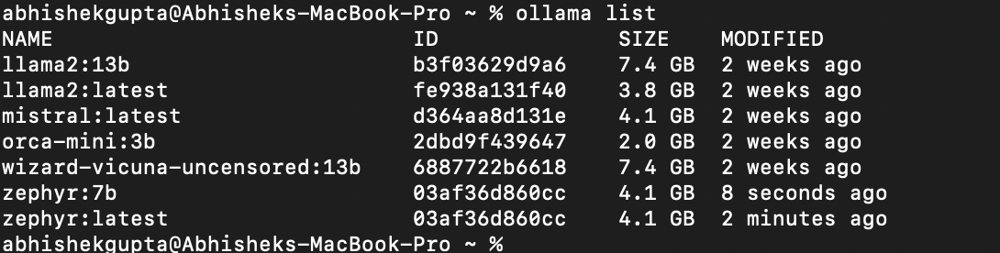
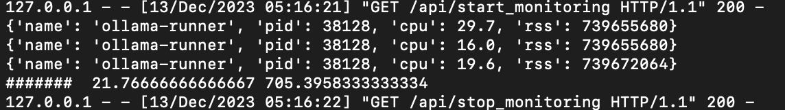
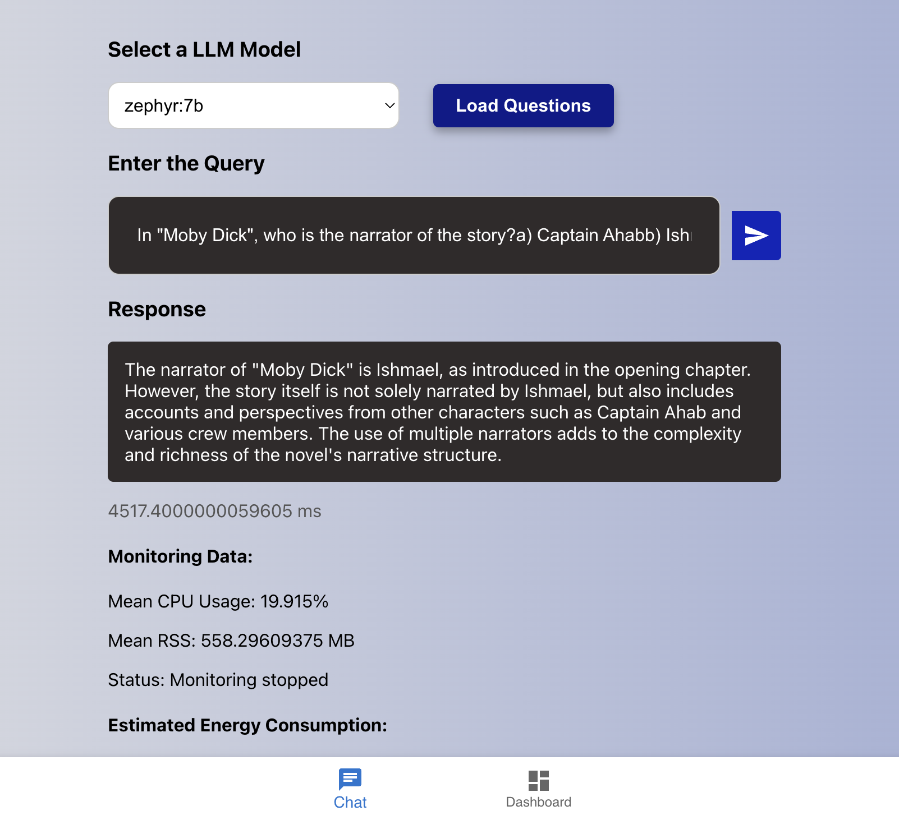
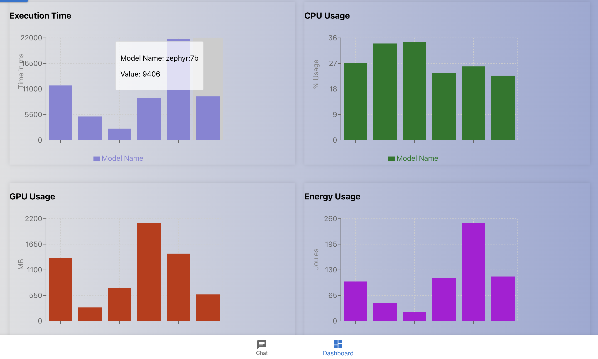

# _LLM Model Perfromance comparision._

### Abhishek Gupta

### Video Link :

### Project Architecture:

`Backend` :

1. `FLASK API` : Flask API is used for calling `psutill` python library to monitor the process `ollama-runner`.
2. `Java Spring Boot` : Java Spring boot rest api is used to make CRUD operation on the `my-sql`database.
3. `Ollama` : All my LLMs' are available through ollama application installed on my local machine. I can access all model via end point to send a query data.

`Database` : MySql data base is used to store the execution metrics like:

- `executionId` : Primary key for the each execution.
- `modelName` : Model Name of the LLM
- `executionTime_avg_plus_sd` : average execution time + standard deviation
- `cpuUsage_avg_plus_sd` : average cpu usage in percentage + standard deviation
- `gpuUsage_avg_plus_sd` : average gpu usage in Mb + standard deviation
- `energyUsage_avg_sd` : Average energy usage in joules.



### LLMs' (Ollama Models) and description:

1. `**llama2:13**` : llama2 model with 13b parameter.
2. `llama2:latest`: llama2 latest is the 7b parameter model.
3. `mistral:latest` : Mistral latest is the 7b paramater model.
4. `wizard-vicuna-uncensored:13b`: Wizard vicuna is a 13b parameter model.
5. `orca-mini:3b` : Orca-mini is a 3b parameter.
6. `zephyr:7b` : Zephyr 7b parameter model.

   

### Questions set for LLM evaluation:

I have picked 10 question from different sources:

- HellaSwag MMLU, HumanEval General Knowledge and Logical Reasoning.

  1. A person sets a folded towel on the edge of a sink. What happens next?

  - a) They turn on the faucet and the towel falls in.
  - b) They leave the room.
  - c) They adjust the towel and fold it again.
  - d) They wet the towel.

  2. A person goes to a vending machine and puts in a dollar bill. What happens next?

  - a) They select a snack and it gets stuck.
  - b) They receive their change and walk away.
  - c) They push the button and receive a soda.
  - d) The machine does not accept the bill.

  3. Who was the first Roman emperor?

  - a) Julius Caesar
  - b) Augustus
  - c) Nero
  - d) Caligula

  4. In "Moby Dick", who is the narrator of the story?

  - a) Captain Ahab
  - b) Ishmael
  - c) Queequeg
  - d) Herman Melville

  5. Write a function in Python that takes a list of numbers and returns the largest number in the list.
  6. Create a Python function that reverses a string.
  7. What is the primary gas found in the Earth's atmosphere?
  8. Which is the largest ocean on Earth?
  9. If you have a bowl with six apples and you take away four, how many do you have?

     a) Two
     b) Four
     c) Six
     d) None

  10. A farmer had 17 sheep, all but nine died. How many are left?

      a) 8
      b) 9
      c) 17
      d) None

### Program flow and process:

1. Frontend: On the chat ui select a model and click on load question button.
2. The questions from `questions.json` will be loaded to the application and will be executed one by one on the model you have selected.
3. For each question when it is triggered, the flask api `start_monitor` end point will be triggered when the execution starts. This will use `psutill` to monitor the status of process `**llama-runne**`. The output will be cpu_usage in % and `rss`(resident set size) value in bytes. Which will be converted to Mb later for calculation. I monitor the process in every 300 ms.
4. Once the query is completed or the process is no longer in the system. The `stop_monitoring` api will be triggered.
   

   

5. After the set of 10 questions get executed, the calculation for mean and standard deviation will be calculated for each metrics.
6. Energy calculation is done based on my laptop specification :

   Taking in the following parameters:

   ```

       // Idle CPU power
       const P_idle = 5;
       // Max CPU power
       const P_max = 25;
       // Idle memory power
       const P_mem_idle = 3;
       // Max memory power
       const P_mem_max = 8;

       // Total RAM memory in MB (16GB RAM)
       const totalMemoryMb = 16000;
   ```

7. With all parameters collected with mean and standard deviation, we now post this data to mySql database using java-spring-boot rest api.
8. Finally, we can see the histograms for each parameter updated in `Dashboard`.

   
